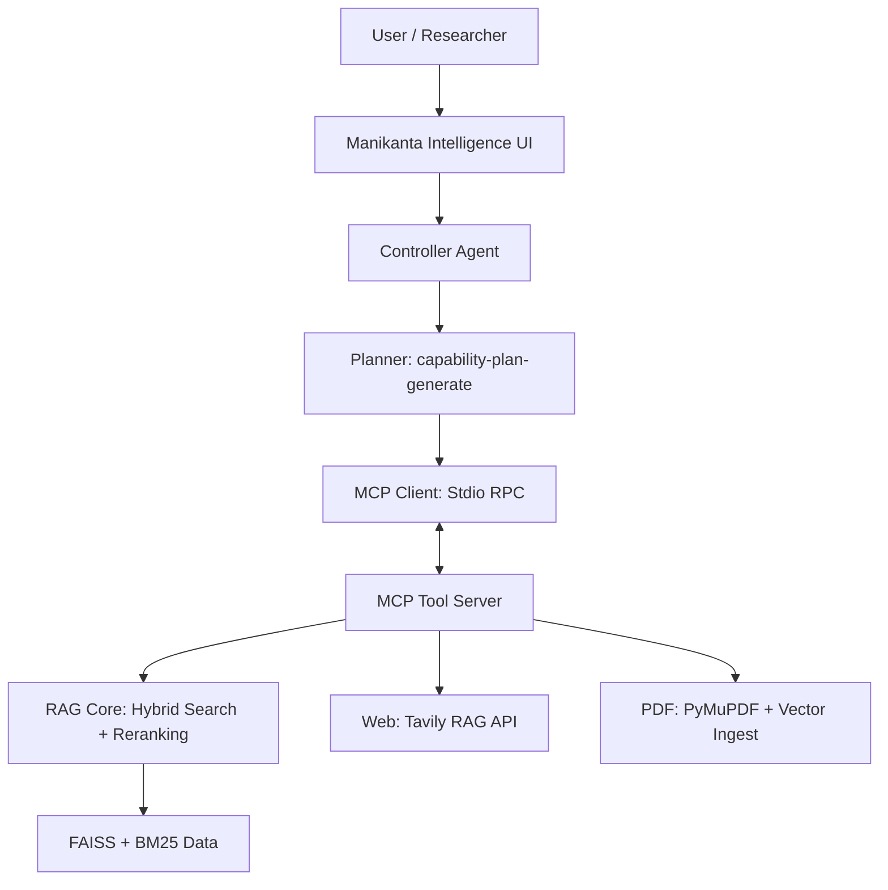

# 🧠 Manikanta Intelligence Platform — Agentic RAG

A high-precision, modular Agentic RAG system built for the *Dive into Deep Learning* hackathon. This system doesn't just search a textbook; it autonomously orchestrates Web, Vector, and Document processing via the **Model Context Protocol (MCP)**.

---

## 🚀 Key Features

- **🛡️ Authentic MCP Architecture**: Decoupled reasoning (Agent) and tools (Server) using JSON-RPC over stdio pipes.
- **⚡ Hybrid High-Precision Retrieval**: Combines **BM25 Keyword Search** with **OpenAI text-embedding-3-small Vector Search**.
- **🎯 Intelligence Layer**: Uses **Cross-Encoder Reranking** (`ms-marco-MiniLM-L-6-v2`) for enterprise-grade accuracy.
- **📡 Multi-Source Awareness**: Seamlessly switches between textbook grounding, live Web search (Tavily), and user-uploaded PDFs.
- **🔐 Human-in-the-Loop (HITL)**: Safety-gated execution for file operations and expensive resource calls.
- **📊 Professional Monitoring**: Real-time Analytics Dashboard tracking cost, latency, and system health.

---

## 🏗️ Project Architecture



---

## 🛠️ Installation & Setup

### 1. Requirements
Ensure you have **Python 3.12+** installed. We recommend using a virtual environment.

```bash
# Create and activate environment
python -m venv .venv
source .venv/bin/activate  # Mac/Linux

# Install dependencies
pip install openai mcp fastmcp tavily-python pymupdf faiss-cpu sentence-transformers rank-bm25 python-dotenv gradio matplotlib
```

### 2. Environment Configuration
Create a `.env` file in the root directory:

```env
OPENAI_API_KEY=sk-your-key-here
TAVILY_API_KEY=tvly-your-key-here
# Optional for Email Bot
EMAIL_ADDRESS=your-bot-email@gmail.com
EMAIL_PASSWORD=your-app-password
```

### 3. Build the Initial Index
If you have the `corpus.json` file in `data/`, build the vector index:

```bash
python scripts/sync_data.py
```

---

## 🚦 How to Run

Open separate terminal windows for each component of the ecosystem:

| Application | Command | URL |
| :--- | :--- | :--- |
| **Intelligence Platform** | `python -m app.main_agentic` | `http://localhost:7861` |
| **Core RAG Explorer** | `python -m app.main_rag` | `http://localhost:7860` |
| **Analytics Dashboard** | `python app/analytics.py` | `http://localhost:7862` |
| **Email Bot** | `python app/email_bot.py` | (Background Thread) |

---

## 📜 Repository Structure
All core application code is located in the **`app/`** directory to satisfy modularity requirements:
- `app/rag.py`: Core hybrid retrieval logic.
- `app/agents.py`: Agentic reasoning and planning.
- `app/mcp_server.py`: Tool definitions and RPC server.
- `app/main_agentic.py`: UI for the Agentic Intelligence Platform.
- `app/main_rag.py`: UI for the strict Textbook Explorer.
- `app/analytics.py`: Cost and performance dashboard.
